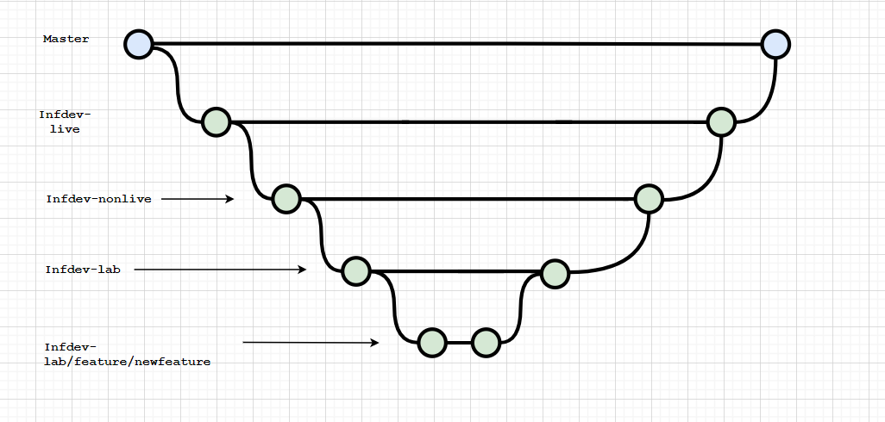

# Kubeflow
[Kubeflow](https://kubeflow.org/) is an open source Kubernetes based ML Platform. This repository defines the manifests that make up a KF deployment.

The basic premise is:
* Core manifests are pulled from [Kubeflow Manifests](https://github.com/kubeflow/manifests) at a frozen commit
* A set of kustomize modules with vars are defined in instance/kustomize relating to components of Kubeflow
* These modules are pulled into a main kustomize file located at instance/kustomize/kustomization.yaml which defines which modules are to be used
* [kpt](https://github.com/GoogleContainerTools/kpt) is used with setters to set vars in the modules
* [kustomize](https://kustomize.io/) is used to hydrate and create manifests either in a folder structure for apply locally or in a single, fat yaml for use with [FluxCD](https://github.com/fluxcd/flux)
* [kubeval](https://github.com/instrumenta/kubeval) is used to validate standard k8s resources
* [istioctl](https://istio.io/latest/docs/reference/commands/istioctl/) frozen at version 1.5.10 to validate Istio resources
* The above processes are mediated with a [Makefile](./Makefile)

## Prerequisites
To run this git repo you require:
1. [kpt](https://github.com/GoogleContainerTools/kpt)
2. [python-yq](https://kislyuk.github.io/yq/)
3. [kustomize](https://kustomize.io/)
4. [Make](https://www.gnu.org/software/make/manual/make.html)
5. [gcloud](https://cloud.google.com/sdk/gcloud)
6. [kubectl](https://kubernetes.io/docs/tasks/tools/install-kubectl/)
7. [kubeval](https://github.com/instrumenta/kubeval)

## Repo Structure
````
kubeflow
├── Makefile
├── README.md
├── fluxcd - fluxcd config, to be moved to core platform
├── .flux.yaml - flux configuration yaml
├── hack - scripts to assist with deployment
└── instance - config relating to the kubeflow deployment
    ├── kubeflow.yaml - fat hydrated yaml (FluxCD build)
    ├── build - folder for hydrated yaml (local build)
    ├── common - folder for common kustomize components
    │   ├── upstream - upstream manifests repo 
    │   ├── kustomize
    │   └── Kptfile - For upstream dependency
    └── env - folder for environment-specific kustomize components
        ├── env1
        │   ├── kustomize
        │   ├── Kptfile
        │   └── settings.yaml - configuration for this environment
        ├── env2
        │   ├── kustomize
        │   ├── Kptfile
        │   └── settings.yaml - configuration for this environment
        └── env3
            ├── kustomize
            ├── Kptfile
            └── settings.yaml - configuration for this environment
     
    


````
## Merge Workflow

Currently, there are three environments in this repository in ./instance/env. These are infdev-lab, infdev-nonlive and infdev-live. These correspond with branches of the same name

The first step before making any changes is to create a feature branch off of the infdev-lab branch, which MUST follow the following naming convention: env/feature/newfeature. Env in this case will be infdev-lab. In this branch, you will make changes in each of the three environment folders in ./instance/env, that is, changes for ALL THREE environments are done in this feature branch. You will then follow this merge workflow:

1. Create a pull request from infdev-lab/feature/newfeature to infdev-lab
2. Once accepted, create a pull request from infdev-lab to infdev-nonlive
3. Once accepted, create a pull request from infdev-nonlive to infdev-live
4. Once accepted, create a final pull request from infdev-live into master.

Changes are designed to be reflected only in the branch you are currently in, hence changes are only reflected in the respective environments as the pull request for that environment is accepted. This workflow is shown below





## Deploying Kubeflow
### Locally
1. Run `make local-hydrate` & review output
2. If all good then run, `make local-apply`
### FluxCD
Fluxcd is configured to run kustomize on releases defined in the fluxcd [config](./fluxcd/kubeflow-kustomize.yaml). Therefore, to deploy to the relevant cluster changes need to be merged into the relevant branch that is being tracked for that particular kubeflow instance. Once merged, changes will be picked up by Flux and the changes will be deployed. Note currently kpt is not run by FluxCD therefore before you merge you must run: `make ready-for-flux`. This will:
1. Pull upstream
2. Set values as per in settings.yaml
3. Run a local hydrate - for verification purposes
4. Run istioctl analyse and kubeval

Once you have run the above and are happy with the output. Raise a PR into relevant branch for FluxCD to pick up at merge.

## Creating a new Kustomize module 
To create a new kustomize module:
1. Create a new kustomize folder in ./instance/kustomize
2. Add in relevant kustomization.yaml. Ensure to extract any vars that will differ across environments
3. Create a kpt setter for any vars by using: `kpt cfg create-setter variablename currenttempvalue`. Note upstream cannot be present when this is done
4. Add to settings.yaml any new variables
5. Edit the top of the Makefile to ensure that new variable is pulled in and update the `set-values` target with any new vars
6. Add relevant kustomize package to core kustomization.yaml
7. Edit ./utils.sh's apply_raw_manifests with the new module in the correct order
8. Add a new kustomize flux resource in the cluster to allow changes to be deployed

## Hack Folder

- connect-to-gke-short.sh - A short script for establishing an SSH connection to the bastion host in the cluster, where some variables have been hardcoded
- connect-to-gke.sh - A longer, generalised and more user friendly script for establishing an SSH connection to a bastion host.
- create-configuration.sh - Creates and gets your kubeflow configuration
- delete-manifests.sh - Deletes the files that are created in the build directory upon executing a build.
-generate-istio-rbac.py - ?????


## TODO
1. Secret management
2. Istio network policies
3. Istio RBAC tightening
4. MTLS
5. Move upstream kustomizations to pull from git repo directly

6. Sort out secrets folder/integrate vault
7. Clean up the makefile 
8. Create build tests to compare changes locally before pushing
9. Improve process for profile creation (lots can be templated)
10. Maybe clean up hack folder? 
11. Proper settings.yaml for live
12. Create gcpserviceaccount for lab and live (lab is still the demo service account, kf-test@vf-infdev-ca-lab.iam.gserviceaccount.com)
